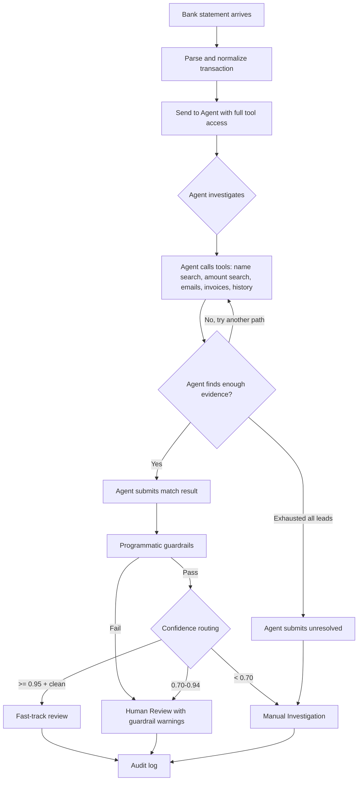

# Agentic Cash Application Pipeline — Full Design & POC Guide

**Audience:** Engineering, Treasury, Operations
**Purpose:** Design a fully agentic pipeline where every bank transaction is investigated by an AI agent using tools — no pre-filter, no two-call chain, just the agent
**Use case:** POC to test whether a single agent with tool access can match payments end-to-end, and to compare its accuracy and cost against the linear pipeline

---

## 1) What This Approach Is

Instead of the linear pipeline (pre-filter → AI Call 1 → AI Call 2), we give the AI a set of tools and let it investigate each bank transaction from scratch.

The agent sees a bank transaction and decides for itself:
- What data to look up
- Which customers to investigate
- Which invoices to match
- When it has enough evidence to submit a conclusion

No code pre-selects candidates. No code decides what data the AI needs. The AI drives the entire investigation.

```
LINEAR PIPELINE (current design):
  Code pre-filters → Code picks candidates → AI picks from shortlist → 
  Code fetches invoices → AI matches invoices → Code validates

AGENTIC PIPELINE (this design):
  AI sees transaction → AI decides what to search → AI calls tools → 
  AI reasons over results → AI searches more if needed → AI submits match
```

### Why Test This?

The linear pipeline has a fundamental weakness: the code-driven pre-filter can eliminate the correct customer before the AI ever sees them. The agent approach eliminates this risk because the AI controls the search — it can follow leads, change direction, and explore paths that a fixed pipeline can't.

The question we're answering with this POC:

> **Does the agent's flexibility produce better matches than the fixed pipeline? And at what cost?**

---

## 2) The Flow — How Every Transaction Is Processed



For every single transaction:

1. **Parse** the bank statement entry into a structured object (code — same as before)
2. **Send to the agent** with the bank transaction details and access to all tools
3. **Agent investigates** — calls tools in whatever order it decides, for up to 10 rounds
4. **Agent submits** a structured result (match or unresolved)
5. **Guardrails** validate the agent's match (code — amounts balance, IDs exist, etc.)
6. **Route** based on confidence (code — auto-post / human review / manual investigation)
7. **Log** everything (code — full conversation trace for audit)

---

## 3) Tools Available to the Agent

The agent has 9 tools. The first 8 are investigation tools that query your local database. The last one is the submission tool that ends the investigation.

### Tool 1: `search_customers_by_name`

Fuzzy search against all customer names and known aliases.

```json
{
  "name": "search_customers_by_name",
  "description": "Search for customers by name using fuzzy matching. Returns top matches with similarity scores. Use when the bank text contains what looks like a company name.",
  "input_schema": {
    "type": "object",
    "required": ["query"],
    "properties": {
      "query": {
        "type": "string",
        "description": "The name or partial name to search for"
      },
      "limit": {
        "type": "integer",
        "default": 5,
        "description": "Maximum number of results to return"
      }
    }
  }
}
```

**Go implementation:**
```go
func SearchCustomersByName(query string, limit int) []CustomerMatch {
    results := fuzzy.FindCustomers(query, allCustomers, 0.3)
    if len(results) > limit {
        results = results[:limit]
    }
    return results // returns: customer_id, name, similarity_score
}
```

### Tool 2: `search_customers_by_amount`

Find customers whose open invoices sum to a given amount.

```json
{
  "name": "search_customers_by_amount",
  "description": "Find all customers whose open invoices (individually or in combination) sum to the given amount within a tolerance percentage. This is often the strongest signal — if only one customer's invoices match, that's likely the payer.",
  "input_schema": {
    "type": "object",
    "required": ["amount"],
    "properties": {
      "amount": {
        "type": "number",
        "description": "The payment amount to match"
      },
      "tolerance_percent": {
        "type": "number",
        "default": 3,
        "description": "Tolerance percentage for matching (e.g., 3 means ±3%)"
      }
    }
  }
}
```

### Tool 3: `get_customer_details`

Get full profile for a specific customer.

```json
{
  "name": "get_customer_details",
  "description": "Get a customer's full profile: name, payment method, discount policy, known bank accounts, and known aliases. Use this after you have a candidate customer ID.",
  "input_schema": {
    "type": "object",
    "required": ["customer_id"],
    "properties": {
      "customer_id": {
        "type": "string",
        "description": "The customer ID (e.g., CUST-0091)"
      }
    }
  }
}
```

### Tool 4: `get_customer_invoices`

Get all open invoices for a customer.

```json
{
  "name": "get_customer_invoices",
  "description": "Get all open invoices for a specific customer. Returns invoice IDs, amounts, due dates, and descriptions. Use this to check if a customer's invoices match the payment amount.",
  "input_schema": {
    "type": "object",
    "required": ["customer_id"],
    "properties": {
      "customer_id": {
        "type": "string",
        "description": "The customer ID"
      }
    }
  }
}
```

### Tool 5: `search_remittance_emails`

Search remittance emails by various criteria.

```json
{
  "name": "search_remittance_emails",
  "description": "Search for remittance advice emails. Customers often send these before or around the time of payment. Returns sender, date, parsed invoice references, and amounts. Try searching by amount and date range first, then narrow by sender if needed.",
  "input_schema": {
    "type": "object",
    "properties": {
      "amount_min": { "type": "number" },
      "amount_max": { "type": "number" },
      "date_from": { "type": "string", "description": "YYYY-MM-DD" },
      "date_to": { "type": "string", "description": "YYYY-MM-DD" },
      "sender_keyword": { "type": "string", "description": "Keyword to search in sender name or email" },
      "invoice_ref": { "type": "string", "description": "Search for a specific invoice reference in email content" }
    }
  }
}
```

### Tool 6: `get_customer_payment_history`

Get a customer's past payment patterns.

```json
{
  "name": "get_customer_payment_history",
  "description": "Get a customer's recent payment history: typical payment method, frequency, usual amounts, and bank text from previous payments. Use this to verify whether a suspected customer's patterns match the current payment.",
  "input_schema": {
    "type": "object",
    "required": ["customer_id"],
    "properties": {
      "customer_id": { "type": "string" }
    }
  }
}
```

### Tool 7: `lookup_reference`

Look up a reference code, account number, or invoice ID in the database.

```json
{
  "name": "lookup_reference",
  "description": "Look up a reference string against all known identifiers: invoice IDs, customer account numbers, bank account numbers, payment references, and aliases. Use this when the bank text or reference field contains a code that might match something in the system.",
  "input_schema": {
    "type": "object",
    "required": ["reference"],
    "properties": {
      "reference": {
        "type": "string",
        "description": "The reference code, account number, or ID to look up"
      }
    }
  }
}
```

### Tool 8: `check_credit_memos`

Check for credit memos that could explain amount mismatches.

```json
{
  "name": "check_credit_memos",
  "description": "Check if a customer has outstanding credit memos that could explain a difference between the payment amount and their invoice total.",
  "input_schema": {
    "type": "object",
    "required": ["customer_id"],
    "properties": {
      "customer_id": { "type": "string" }
    }
  }
}
```

### Tool 9: `submit_match_result` (Final Submission — Ends Investigation)

```json
{
  "name": "submit_match_result",
  "description": "Submit your final matching result. You MUST call this tool to complete the investigation. Call it when you have identified the customer and matched invoices, OR when you have exhausted all leads and cannot determine the match.",
  "input_schema": {
    "type": "object",
    "required": ["status", "confidence", "reasoning", "investigation_summary"],
    "properties": {
      "status": {
        "type": "string",
        "enum": ["matched", "unresolved"],
        "description": "'matched' if you identified the customer and invoices, 'unresolved' if you could not"
      },
      "customer_id": { "type": "string" },
      "customer_name": { "type": "string" },
      "confidence": {
        "type": "number", "minimum": 0, "maximum": 1,
        "description": "0.0-1.0. Set to 0 if unresolved."
      },
      "invoices": {
        "type": "array",
        "items": {
          "type": "object",
          "required": ["id", "original_amount", "applied"],
          "properties": {
            "id": { "type": "string" },
            "original_amount": { "type": "number" },
            "applied": { "type": "number" },
            "deduction": { "type": "number", "default": 0 },
            "reason": {
              "type": "string",
              "enum": ["early_pay_discount", "damaged_goods", "short_shipment", "pricing_dispute", "credit_memo", "unknown", null]
            }
          }
        }
      },
      "total_applied": { "type": "number" },
      "unmatched_amount": { "type": "number" },
      "reasoning": { "type": "string" },
      "investigation_summary": {
        "type": "string",
        "description": "Step-by-step summary of what you searched, what you found, and what you concluded. This is shown to the human reviewer."
      },
      "suggested_alias": {
        "type": "string",
        "description": "If the bank text doesn't match the customer name, suggest an alias mapping for future automatic matching (e.g., 'JPMC COLL ACCT 99281 → CUST-0142')"
      }
    }
  }
}
```

---

## 4) The System Prompt

This is sent with every transaction. It tells the agent how to think and investigate.

```
You are a treasury cash application specialist at Tauber Oil Company. Your job is to match each incoming bank payment to the correct customer and their open invoices.

For each payment, you have access to tools that search our database. You must investigate systematically:

INVESTIGATION STRATEGY (follow this order):
1. ANALYZE the bank text — does it contain a company name, account number, invoice reference, or is it just a wire network code?
2. If the bank reference or memo contains what looks like an invoice number or account code, use lookup_reference first — this is the fastest path to a match.
3. Search by AMOUNT — use search_customers_by_amount. This is often the strongest signal. If only one customer's invoices sum to the payment amount, that's very likely the payer.
4. Search by NAME — if the bank text contains what looks like a company name, use search_customers_by_name.
5. Search REMITTANCE EMAILS — use search_remittance_emails with the payment amount and date range. Customers often email remittance advice around the time of payment.
6. For each candidate customer, get their invoices with get_customer_invoices and check if invoice amounts align with the payment.
7. VERIFY your top candidate with get_customer_payment_history — does this customer typically pay this way?
8. Once you have enough evidence, submit your result with submit_match_result.

RULES:
- You have a maximum of 10 tool calls. Be efficient — don't repeat searches.
- Confidence scoring:
  - 0.95+: Multiple confirming signals (amount match + name match + remittance email, or amount match + payment history pattern)
  - 0.85-0.94: Strong single signal confirmed by one other (e.g., amount match + name match)
  - 0.70-0.84: Reasonable match but only one signal (e.g., only amount match, no name confirmation)
  - Below 0.70: Weak evidence — submit as unresolved unless you have a specific reason to believe the match
- Account for early-pay discounts (typically 1-2% of invoice amount) and short-payments
- Valid deduction reasons: early_pay_discount, damaged_goods, short_shipment, pricing_dispute, credit_memo, unknown
- If you identify a match where the bank text doesn't resemble the customer name, suggest an alias in suggested_alias
- Do NOT guess. If the evidence is insufficient, submit status "unresolved" with a clear summary of what you tried.
- You MUST call submit_match_result to end your investigation.
```

---

## 5) Full Worked Example 1 — Easy Match (Name + Amount)

### Bank Transaction

```
TXN-ID:      TXN-001
Date:         2024-04-10
Amount:       $47,230.00
Counterparty: "ACME CORP INT WIRE"
Reference:    "PAYMENT REF 88421"
Memo:         ""
```

### Round 1 — Agent Analyzes and Searches

The agent reads the bank text, sees "ACME CORP" which looks like a company name, and also a reference code. It starts with the reference and a name search in parallel.

**Agent response:**
```
"The bank text contains 'ACME CORP' which looks like a company name, 
and reference 'PAYMENT REF 88421'. Let me look up the reference and 
search for customers named Acme."
```

**Agent calls:** `lookup_reference("PAYMENT REF 88421")`

**Tool result:**
```
No match found for "PAYMENT REF 88421" in invoice IDs, customer accounts, 
or known references.
```

### Round 2 — Agent Searches by Name and Amount

**Agent calls:** `search_customers_by_name("ACME CORP")`

**Tool result:**
```
Found 3 matches:
1. Acme Corp Ltd (CUST-0091) — similarity: 0.82
2. Acme Corporation (CUST-0445) — similarity: 0.71
3. Acme Corp International (CUST-0201) — similarity: 0.68
```

### Round 3 — Agent Searches by Amount

**Agent calls:** `search_customers_by_amount(47230, 3)`

**Tool result:**
```
Found 1 customer with matching invoice combination:

1. Acme Corp Ltd (CUST-0091)
   - INV-312: $25,000.00 + INV-287: $22,730.00 = $47,730.00 
     (1.06% over payment — possible early-pay discount)
```

### Round 4 — Agent Gets Invoices to Verify

**Agent calls:** `get_customer_invoices("CUST-0091")`

**Tool result:**
```
Open invoices for Acme Corp Ltd (CUST-0091):
  INV-312 — $25,000.00 — due 2024-04-15 — fuel delivery March 28
  INV-287 — $22,730.00 — due 2024-04-12 — fuel delivery March 15
  INV-301 — $18,500.00 — due 2024-04-30 — equipment rental April
```

### Round 5 — Agent Checks for Remittance Email

**Agent calls:** `search_remittance_emails({amount_min: 46000, amount_max: 48500, date_from: "2024-04-05", date_to: "2024-04-11"})`

**Tool result:**
```
Found 1 matching remittance email:

  From: ap@acmecorp.com
  Received: 2024-04-09
  Subject: "Payment notification - April batch"
  Body: "Please find attached remittance for wire transfer April 10.
         INV-312: $25,000.00
         INV-287: $22,230.00 (2% early payment discount applied)
         Total: $47,230.00"
```

### Round 6 — Agent Submits Match

**Agent calls:** `submit_match_result({...})`

```json
{
  "status": "matched",
  "customer_id": "CUST-0091",
  "customer_name": "Acme Corp Ltd",
  "confidence": 0.97,
  "invoices": [
    {
      "id": "INV-312",
      "original_amount": 25000.00,
      "applied": 25000.00,
      "deduction": 0,
      "reason": null
    },
    {
      "id": "INV-287",
      "original_amount": 22730.00,
      "applied": 22230.00,
      "deduction": 500.00,
      "reason": "early_pay_discount"
    }
  ],
  "total_applied": 47230.00,
  "unmatched_amount": 0,
  "reasoning": "Three confirming signals: (1) Fuzzy name match — 'ACME CORP INT WIRE' closely matches 'Acme Corp Ltd'. (2) Invoice amount match — INV-312 + INV-287 with 2% discount on INV-287 sums to exactly $47,230. (3) Remittance email from ap@acmecorp.com explicitly lists both invoices and confirms the discount.",
  "investigation_summary": "1. Looked up reference 'PAYMENT REF 88421' — no match.\n2. Searched customers by name 'ACME CORP' — found 3 Acme variants.\n3. Searched by amount $47,230 (±3%) — only Acme Corp Ltd has a matching invoice combination.\n4. Fetched invoices for CUST-0091 — confirmed INV-312 and INV-287.\n5. Found remittance email from ap@acmecorp.com confirming both invoices and the discount.\n6. High confidence match with three independent signals.",
  "suggested_alias": null
}
```

**Tool calls used: 6** (lookup_reference, search_by_name, search_by_amount, get_invoices, search_emails, submit)

---

## 6) Full Worked Example 2 — Hard Match (Intermediary Bank, No Name)

### Bank Transaction

```
TXN-ID:      TXN-042
Date:         2024-04-10
Amount:       $47,230.00
Counterparty: "JPMC COLL ACCT 99281"
Reference:    "WIRE TRF 2024-04-10"
Memo:         ""
```

### Round 1 — Agent Analyzes

**Agent response:**
```
"The counterparty 'JPMC COLL ACCT 99281' looks like a JP Morgan Chase 
collection account — this is a bank intermediary, not the actual customer. 
The name won't help identify the payer. Let me look up the account number 
and search by amount."
```

**Agent calls:** `lookup_reference("JPMC COLL ACCT 99281")`

**Tool result:**
```
No match found for "JPMC COLL ACCT 99281" in invoice IDs, customer 
accounts, or known references.
```

### Round 2 — Agent Searches by Amount

**Agent calls:** `search_customers_by_amount(47230, 3)`

**Tool result:**
```
Found 2 customers with matching invoice combinations:

1. Baker Industries (CUST-0142)
   - INV-501: $25,000.00 + INV-502: $22,730.00 = $47,730.00 (1.06% over)
   
2. Pacific Energy Corp (CUST-0287)
   - INV-801: $30,000.00 + INV-802: $17,500.00 = $47,500.00 (0.57% over)
```

### Round 3 — Agent Searches Remittance Emails

**Agent calls:** `search_remittance_emails({amount_min: 46000, amount_max: 48500, date_from: "2024-04-05", date_to: "2024-04-11"})`

**Tool result:**
```
Found 1 matching remittance email:

  From: accountspayable@bakerindustries.com
  Received: 2024-04-09
  Subject: "Wire payment notification - April"
  Body: "Please note wire transfer of $47,230.00 scheduled for April 10.
         INV-501: $25,000.00
         INV-502: $22,230.00 (2.2% prompt payment discount applied)
         Total: $47,230.00"
```

### Round 4 — Agent Verifies Payment History

**Agent calls:** `get_customer_payment_history("CUST-0142")`

**Tool result:**
```
Baker Industries (CUST-0142):
  Payment method: wire transfer
  Typical frequency: monthly
  Last 3 payments:
    - 2024-03-08: $31,200 via "JPMC COLL ACCT 99281"
    - 2024-02-12: $18,500 via "JPMC COLL ACCT 99281"
    - 2024-01-15: $42,100 via "JPMC COLL ACCT 99281"
  Discount policy: 2% early-pay on invoices paid within 15 days
```

### Round 5 — Agent Submits Match

**Agent calls:** `submit_match_result({...})`

```json
{
  "status": "matched",
  "customer_id": "CUST-0142",
  "customer_name": "Baker Industries",
  "confidence": 0.96,
  "invoices": [
    {
      "id": "INV-501",
      "original_amount": 25000.00,
      "applied": 25000.00,
      "deduction": 0,
      "reason": null
    },
    {
      "id": "INV-502",
      "original_amount": 22730.00,
      "applied": 22230.00,
      "deduction": 500.00,
      "reason": "early_pay_discount"
    }
  ],
  "total_applied": 47230.00,
  "unmatched_amount": 0,
  "reasoning": "Baker Industries pays through JPMC collection account 99281 — confirmed by 3 months of payment history all showing the same bank text. Remittance email from ap@bakerindustries.com confirms INV-501 ($25,000) and INV-502 ($22,230 after 2.2% discount). Total matches payment exactly.",
  "investigation_summary": "1. Looked up 'JPMC COLL ACCT 99281' — not in alias table.\n2. Searched by amount $47,230 (±3%) — found Baker Industries and Pacific Energy Corp.\n3. Searched remittance emails — found email from Baker Industries confirming both invoices.\n4. Checked Baker Industries payment history — last 3 payments all came through 'JPMC COLL ACCT 99281'.\n5. Strong match: amount + remittance email + payment history pattern all confirm Baker Industries.",
  "suggested_alias": "JPMC COLL ACCT 99281 → CUST-0142 (Baker Industries)"
}
```

**Tool calls used: 5** (lookup_reference, search_by_amount, search_emails, payment_history, submit)

**This is the case the linear pipeline couldn't solve** — it eliminated Baker Industries because the name "JPMC COLL ACCT 99281" has zero similarity to "Baker Industries." The agent solved it in 5 tool calls by following the amount and email signals.

---

## 7) Full Worked Example 3 — Unresolvable Transaction

### Bank Transaction

```
TXN-ID:      TXN-099
Date:         2024-04-10
Amount:       $82,441.00
Counterparty: "FEDWIRE 20240410-88921"
Reference:    ""
Memo:         ""
```

### Agent Investigation

| Round | Tool Called | Result |
|-------|-----------|--------|
| 1 | `lookup_reference("FEDWIRE 20240410-88921")` | No match |
| 2 | `search_customers_by_amount(82441, 3)` | 0 customers have matching invoice combinations |
| 3 | `search_remittance_emails({amount_min: 80000, amount_max: 85000, date_from: "2024-04-03", date_to: "2024-04-11"})` | No matching emails |
| 4 | `search_customers_by_name("FEDWIRE")` | 0 results |
| 5 | `search_customers_by_amount(82441, 5)` | Still 0 — widened to 5% but no match |

### Agent Submits Unresolved

```json
{
  "status": "unresolved",
  "confidence": 0,
  "reasoning": "Unable to identify the customer. No customer has invoices summing to $82,441 even with 5% tolerance. No remittance emails match. 'FEDWIRE' is a wire network identifier, not a customer.",
  "investigation_summary": "1. Looked up reference — no match.\n2. Searched by amount $82,441 (±3%) — no customer has matching invoices.\n3. Searched remittance emails ($80K-$85K, Apr 3-11) — no matches.\n4. Searched by name 'FEDWIRE' — no customer match (FEDWIRE is the wire network).\n5. Widened amount search to ±5% — still no match.\n\nPossible explanations:\n  a) New customer not yet in the system\n  b) Prepayment or advance deposit with no invoice created yet\n  c) Payment intended for a different business entity\n\nRecommended: Contact the bank for the full wire originator details (OBI field). Reference 88921 can be used to trace the sender.",
  "suggested_alias": null
}
```

**Tool calls used: 6** (lookup, amount search, emails, name search, wider amount search, submit)

---

## 8) How the Go Code Runs the Agent

```go
type AgentConfig struct {
    Model        string // "claude-sonnet-4-20250514"
    MaxToolCalls int    // 10
    TimeoutSec   int    // 60
}

func RunAgentForTransaction(txn BankTransaction, cfg AgentConfig) (*MatchResult, error) {
    // Build initial messages
    messages := []Message{
        {Role: "user", Content: buildTransactionPrompt(txn)},
    }
    
    toolCallCount := 0

    for toolCallCount < cfg.MaxToolCalls {
        // Call Claude API with tools
        resp, err := callClaudeWithTools(cfg.Model, systemPrompt, tools, messages)
        if err != nil {
            return nil, fmt.Errorf("claude API error: %w", err)
        }

        // Check if agent submitted final result
        if result := extractSubmitResult(resp); result != nil {
            // Run programmatic guardrails on the result
            guardrailResult := validateMatch(result, txn)
            result.GuardrailsPassed = guardrailResult.AllPassed
            result.GuardrailDetails = guardrailResult.Details
            return result, nil
        }

        // Extract and execute tool calls
        toolCalls := extractToolCalls(resp)
        if len(toolCalls) == 0 {
            // Agent responded with text only, no tool call — prompt it to submit
            messages = append(messages, resp.AsMessage())
            messages = append(messages, Message{
                Role:    "user",
                Content: "Please submit your result using submit_match_result.",
            })
            continue
        }

        // Execute each tool against local data
        toolResults := make([]ToolResult, 0)
        for _, call := range toolCalls {
            result := executeToolLocally(call)
            toolResults = append(toolResults, result)
            toolCallCount++
        }

        // Append to conversation and continue
        messages = append(messages, resp.AsMessage())
        messages = append(messages, buildToolResultsMessage(toolResults))
    }

    // Hit max tool calls — force unresolved
    return &MatchResult{
        Status:     "unresolved",
        Confidence: 0,
        Reasoning:  "Agent reached maximum tool call limit",
    }, nil
}
```

### The Main Loop (Process All Transactions)

```go
func main() {
    transactions := loadBankTransactions("data/bank_transactions.json")
    cfg := AgentConfig{
        Model:        "claude-sonnet-4-20250514",
        MaxToolCalls: 10,
        TimeoutSec:   60,
    }

    var results []MatchResult
    totalCost := 0.0

    for _, txn := range transactions {
        fmt.Printf("Processing %s: $%.2f from '%s'...\n", 
            txn.TxnID, txn.Amount, txn.CounterpartyName)
        
        result, err := RunAgentForTransaction(txn, cfg)
        if err != nil {
            fmt.Printf("  ERROR: %v\n", err)
            continue
        }

        results = append(results, *result)
        totalCost += result.Cost

        fmt.Printf("  Result: %s | Customer: %s | Confidence: %.2f\n",
            result.Status, result.CustomerName, result.Confidence)
        fmt.Printf("  Tool calls: %d | Cost: $%.4f\n",
            result.ToolCallCount, result.Cost)
    }

    printSummary(results, totalCost)
    saveResults(results, "results/agent_results.json")
}
```

---

## 9) Cost Estimation — Every Transaction Through the Agent

This is the key difference from the previous design. Previously the agent only handled ~5 failures/day. Now it handles all 500 transactions/day.

### Token Usage Per Transaction Type

**Easy match (name visible, amount matches) — ~60% of transactions:**

| Round | Input Tokens (cumulative) | Output Tokens | Tool Calls |
|-------|--------------------------|---------------|------------|
| 1: Analyze + lookup reference | ~1,200 | ~60 | 1 |
| 2: Search by name | ~1,500 | ~50 | 1 |
| 3: Search by amount | ~1,800 | ~50 | 1 |
| 4: Get invoices | ~2,200 | ~50 | 1 |
| 5: Search remittance emails | ~2,600 | ~50 | 1 |
| 6: Submit result | ~3,000 | ~250 | 1 |
| **Total billed input** | **~12,300** | | |
| **Total billed output** | | **~510** | **6 calls** |

**Medium match (ambiguous name or intermediary) — ~30% of transactions:**

| Round | Input Tokens (cumulative) | Output Tokens | Tool Calls |
|-------|--------------------------|---------------|------------|
| 1-3: Initial searches | ~2,000 | ~180 | 3 |
| 4-5: Deeper investigation | ~3,200 | ~120 | 2 |
| 6-7: Verify + history | ~4,200 | ~100 | 2 |
| 8: Submit result | ~4,800 | ~280 | 1 |
| **Total billed input** | **~14,200** | | |
| **Total billed output** | | **~680** | **8 calls** |

**Hard / unresolvable — ~10% of transactions:**

| Round | Input Tokens (cumulative) | Output Tokens | Tool Calls |
|-------|--------------------------|---------------|------------|
| 1-5: Exhaustive search | ~3,500 | ~250 | 5 |
| 6-8: Wider searches, verification | ~5,500 | ~200 | 3 |
| 9: Submit unresolved | ~6,000 | ~300 | 1 |
| **Total billed input** | **~15,000** | | |
| **Total billed output** | | **~750** | **9 calls** |

### Cost Per Transaction (Claude Sonnet — $3/M input, $15/M output)

```
Easy match (60%):
  Input:  12,300 × $3.00/M  = $0.037
  Output:    510 × $15.00/M = $0.008
  Total: ~$0.045

Medium match (30%):
  Input:  14,200 × $3.00/M  = $0.043
  Output:    680 × $15.00/M = $0.010
  Total: ~$0.053

Hard / unresolvable (10%):
  Input:  15,000 × $3.00/M  = $0.045
  Output:    750 × $15.00/M = $0.011
  Total: ~$0.056

Weighted average per transaction: ~$0.049
```

**With prompt caching** (system prompt + tools ~1,200 tokens cached across all rounds):

```
Easy match:   ~$0.032  (caching saves ~30% on input)
Medium match: ~$0.040
Hard match:   ~$0.044

Weighted average with caching: ~$0.036
```

### Daily and Monthly Cost (500 Transactions/Day)

| | Claude Sonnet (no cache) | Claude Sonnet (cached) | gpt-5.4-nano | gpt-5.4-nano + Batch |
|---|---|---|---|---|
| Cost per txn | $0.049 | $0.036 | $0.004 | $0.002 |
| Daily (500 txns) | $24.50 | $18.00 | $2.00 | $1.00 |
| Monthly | **$735** | **$540** | **$60** | **$30** |
| Yearly | $8,820 | $6,480 | $720 | $360 |

### Cost Comparison — Agent vs Linear Pipeline

| | Linear Pipeline | Agentic Pipeline | Difference |
|---|---|---|---|
| Claude Sonnet (cached) / month | ~$64 | ~$540 | **8.4x more expensive** |
| gpt-5.4-nano / month | ~$9 | ~$60 | **6.7x more expensive** |
| gpt-5.4-nano + Batch / month | ~$4.50 | ~$30 | **6.7x more expensive** |

The agent approach costs 7-8x more because:
1. Each transaction requires 6-9 tool calls instead of 1-2 API calls
2. Each round re-sends the growing conversation (cumulative input tokens)
3. The agent explores even on easy transactions where a simple name+amount match would suffice

---

## 10) Honest Trade-off Analysis — Agent vs Linear Pipeline

### Where the Agent Wins

| Advantage | Why |
|-----------|-----|
| No pre-filter elimination risk | Agent searches broadly — never eliminates correct customer before seeing them |
| Handles intermediary bank names | Agent follows amount + email signals when name is useless |
| Adapts per transaction | Hard cases get more investigation; easy cases the agent solves quickly |
| Better reasoning | Agent sees the full evidence chain and can change direction mid-investigation |
| Simpler code | No pre-filter logic, no two-call orchestration, no retry branches — just the agent loop |

### Where the Agent Loses

| Disadvantage | Why |
|-------------|-----|
| 7-8x more expensive | Every transaction gets 6-9 API round-trips even if the match is obvious |
| 3-5x slower | Each round-trip is ~1-2 seconds, so 6-9 rounds = 6-18 seconds per transaction vs 2-4 seconds |
| Less predictable | Agent might take different paths on re-run (even at temperature 0, multi-turn conversations can vary) |
| Harder to debug | Multi-turn conversation is harder to trace than a fixed pipeline with clear stages |
| Overkill for easy cases | 60% of transactions have an obvious name+amount match — the agent still does 6 tool calls |

### The Real Question for the POC

The accuracy difference is what matters. If the agent matches 95% of transactions correctly while the linear pipeline matches 88%, that 7% improvement might justify the 8x cost increase — especially if those 7% would otherwise require expensive human investigation.

**What to measure in the POC:**

| Metric | Linear Pipeline | Agentic Pipeline |
|--------|----------------|-----------------|
| Correct customer identification | ?% | ?% |
| Correct invoice matching | ?% | ?% |
| Cases requiring human review | ?% | ?% |
| Cases the linear pipeline missed but agent caught | N/A | ? count |
| Average cost per transaction | ~$0.008 | ~$0.036 |
| Average time per transaction | ~2-4 sec | ~6-18 sec |

---

## 11) POC Test Plan

### Dummy Data (Same as `poc_design.md`)

Use the same 10 test transactions from the existing POC design, but process all of them through the agent. Compare agent results against expected results AND against the linear pipeline results.

### Test Scenarios That Specifically Favor the Agent

Add these scenarios to test where the agent should outperform the linear pipeline:

| TXN | Scenario | Why Agent Should Win |
|-----|----------|---------------------|
| TXN-011 | Intermediary bank name, no customer name visible | Agent follows amount + email; linear pipeline's pre-filter fails |
| TXN-012 | Customer changed legal name recently | Agent finds match via amount + payment history pattern |
| TXN-013 | Payment covers invoice from one customer + credit memo from another | Agent can check credit memos; linear pipeline assumes single customer |
| TXN-014 | Remittance email arrived but from a different email domain | Agent searches emails by amount, finds it; linear pipeline searches by customer name |
| TXN-015 | Batch payment — one wire covering multiple customers' invoices | Agent can detect this pattern by searching amounts and cross-referencing |

### How to Run the Comparison

```bash
# Run linear pipeline on all test transactions
go run ./cmd/main.go -mode linear -output results/linear_results.json

# Run agentic pipeline on all test transactions
go run ./cmd/main.go -mode agent -output results/agent_results.json

# Compare results
go run ./cmd/compare.go results/linear_results.json results/agent_results.json
```

The comparison tool should output:

```
=== Pipeline Comparison ===

                          Linear    Agent
Correct customer ID:      8/15      12/15
Correct invoice match:    7/15      11/15
Unresolved:               3/15      2/15
Avg confidence:           0.84      0.89
Avg tool calls:           2.1       6.8
Avg cost per txn:         $0.008    $0.038
Total cost:               $0.12     $0.57

Cases agent solved that linear missed:
  TXN-011: Agent found Baker Industries via amount + email
  TXN-012: Agent found renamed customer via payment history
  TXN-014: Agent found remittance email by amount search

Cases linear solved that agent missed:
  (none in this test)
```

---

## 12) Recommendation — Hybrid Approach (After POC Results)

Based on what the POC reveals, the likely best production architecture is a **hybrid**:

```
For each bank transaction:

  1. Try the cheap linear pipeline first
     (short-circuit → pre-filter → Call 1 → Call 2)
     Cost: $0.00 - $0.011

  2. If the linear pipeline succeeds with confidence >= 0.70
     → Use its result (cheap and fast)

  3. If the linear pipeline fails OR confidence < 0.70
     → Hand off to the agent for full investigation
     → Cost: ~$0.03-0.05 per investigation

This gives you:
  - Linear pipeline cost for 90% of transactions
  - Agent accuracy for the 10% that are hard
  - Best of both worlds
```

But you need the POC data to prove this. Run both approaches, compare, and let the numbers decide.

---

## 13) Architecture Diagram

```
┌──────────────────────────────────────────────────────────────────┐
│                    AGENTIC PIPELINE (POC)                         │
│                                                                   │
│  For EVERY transaction:                                           │
│                                                                   │
│  ┌────────────────────────────────────────────────────────────┐  │
│  │                                                             │  │
│  │  Bank Transaction                                           │  │
│  │       │                                                     │  │
│  │       ▼                                                     │  │
│  │  ┌─────────────────────────────────────────────────────┐   │  │
│  │  │         CLAUDE AGENT + 9 TOOLS                       │   │  │
│  │  │                                                      │   │  │
│  │  │  The agent decides what to search:                   │   │  │
│  │  │                                                      │   │  │
│  │  │  ┌──────────────┐  ┌──────────────────────────┐     │   │  │
│  │  │  │ Round 1      │  │ Local Database            │     │   │  │
│  │  │  │ Analyze +    │◄─┤                           │     │   │  │
│  │  │  │ lookup ref   │  │ • Customers (500+)        │     │   │  │
│  │  │  └──────┬───────┘  │ • Invoices (1500+)        │     │   │  │
│  │  │         ▼          │ • Remittance emails        │     │   │  │
│  │  │  ┌──────────────┐  │ • Payment history          │     │   │  │
│  │  │  │ Round 2-N    │◄─┤ • Aliases                  │     │   │  │
│  │  │  │ Search, get  │  │ • Credit memos             │     │   │  │
│  │  │  │ invoices,    │  │                           │     │   │  │
│  │  │  │ verify       │  └──────────────────────────┘     │   │  │
│  │  │  └──────┬───────┘                                    │   │  │
│  │  │         ▼                                             │   │  │
│  │  │  ┌──────────────┐                                    │   │  │
│  │  │  │ Final Round  │                                    │   │  │
│  │  │  │ Submit match │                                    │   │  │
│  │  │  │ result       │                                    │   │  │
│  │  │  └──────────────┘                                    │   │  │
│  │  │                                                      │   │  │
│  │  │  Max 10 tool calls │ 60 second timeout               │   │  │
│  │  └─────────────────────────────────────────────────────┘   │  │
│  │       │                                                     │  │
│  │       ▼                                                     │  │
│  │  Programmatic Guardrails                                    │  │
│  │  (amounts balance, IDs exist, deductions within policy)     │  │
│  │       │                                                     │  │
│  │       ▼                                                     │  │
│  │  Confidence Routing                                         │  │
│  │  ├─ >= 0.95 + guardrails pass → Fast-track review           │  │
│  │  ├─ 0.70-0.94                 → Human review                │  │
│  │  └─ < 0.70 or unresolved     → Manual investigation         │  │
│  │       │                                                     │  │
│  │       ▼                                                     │  │
│  │  Audit Log (full conversation trace)                        │  │
│  │                                                             │  │
│  └────────────────────────────────────────────────────────────┘  │
│                                                                   │
│  Cost: ~$0.036 per transaction (Claude Sonnet, cached)            │
│  Cost: ~$0.004 per transaction (gpt-5.4-nano)                     │
│  Speed: ~6-18 seconds per transaction                             │
│                                                                   │
└──────────────────────────────────────────────────────────────────┘
```
