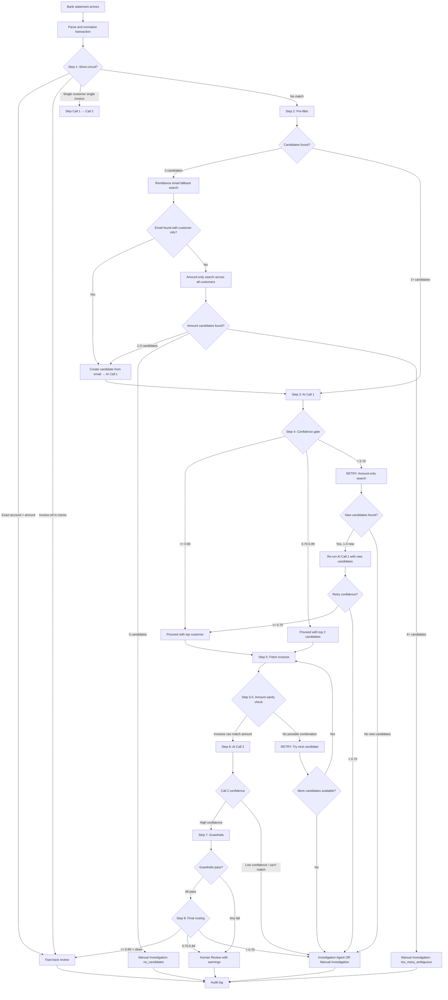

# Pipeline Problems & Alternative Flows

**Audience:** Engineering, Treasury, Operations
**Purpose:** Document gaps in the current solution and all possible flow paths
**Context:** Builds on `solution_focused_pipeline.md` and `pipeline_design_and_decisions.md`

---

## 1) Problems With the Current Pipeline Design

The current pipeline (documented in `solution_focused_pipeline.md`) handles the happy path well but has gaps in edge cases and failure recovery.

### Problem 1: Pre-filter Returns Zero Candidates

**What happens today:** Step 2 (pre-filter) assumes it will always produce 3-8 candidates. There is no defined behavior when it produces zero.

**When this happens:**
- Bank text is an intermediary bank name, not the customer (e.g., "JPMC COLL ACCT 99281")
- Customer paid through a subsidiary or parent company using a name we've never seen
- A factoring company or collection agency sent the payment on behalf of the customer
- Bank text is a pure reference code with no name (e.g., "WIRE TRF REF 44821")
- Genuinely new customer not yet in the system

**Impact:** The pipeline has no defined path. The transaction would either error out or silently fall through to manual investigation with no useful information attached.

---

### Problem 2: Pre-filter Eliminates the Correct Customer

**What happens today:** The fuzzy name matcher finds candidates based on text similarity. If the bank text doesn't resemble the actual customer's name, the correct customer is eliminated before the AI ever sees them.

**Example:**
- Bank text: "JPMC COLL ACCT 99281"
- Correct customer: Baker Industries (pays through JPMC collection account)
- Fuzzy match result: zero similarity between "JPMC COLL ACCT 99281" and "Baker Industries"
- Baker Industries is removed from the candidate list
- AI never gets a chance to identify the correct customer

**Why this is dangerous:** The pipeline confidently proceeds with wrong candidates (or no candidates), spends AI cost, and still fails. The correct answer was filtered out by deterministic code before AI reasoning could be applied.

---

### Problem 3: AI Call 1 Confident, But No Invoice Combination Matches

**What happens today:** AI Call 1 identifies a customer with high confidence (e.g., 0.85 based on name similarity). The pipeline fetches that customer's invoices. But no combination of their invoices sums to the payment amount, even with tolerance.

**Example:**
- AI says: "This is Acme Corp Ltd, confidence 0.85" (name matched well)
- Acme Corp Ltd open invoices: $15,000 + $8,200 + $12,500 = $35,700 total
- Payment amount: $47,230
- No subset of Acme's invoices can produce $47,230

**Result:** AI Call 2 returns low confidence. Two AI calls wasted. The real customer might have been candidate #2 or might not have been in the candidate list at all.

**Current behavior:** Routes to manual investigation, but doesn't try alternative candidates.

---

### Problem 4: Fuzzy Name Matching Is the Weakest Signal But Is Weighted Too Heavily

**What happens today:** The pre-filter lists fuzzy name matching as Filter 1 (primary), with amount-combination search as Filter 2 (secondary).

**The reality:**

| Signal | Reliability | Why |
|--------|------------|-----|
| Invoice reference in memo | Very high | Direct link to a specific invoice |
| Account number match | Very high | Known bank account to known customer |
| Amount combination match | High | Math is objective — invoices either sum to the amount or they don't |
| Remittance email match | High | Customer explicitly states what they're paying |
| Fuzzy name match | **Low** | Bank text is frequently garbage — intermediaries, abbreviations, codes |

A customer found only by amount match (their invoices perfectly sum to the payment) is a much stronger candidate than one found only by name similarity. But the current design treats name as the primary signal.

---

### Problem 5: No Recovery Mechanism When the Pipeline Fails

**What happens today:** If Call 1 returns low confidence OR Call 2 can't match invoices, the transaction goes straight to manual investigation. There is no retry, no widening of the search, no fallback strategy.

**What should happen:** Before sending to humans, the system should try alternative investigation paths — different candidate sets, amount-only searches, remittance email searches. These cost almost nothing (code-only) or very little (one more AI call) but could resolve 40-60% of failures.

---

### Problem 6: No Alias Learning from Human Resolutions

**What happens today:** When a human resolves a failed transaction (e.g., "this wire from JPMC COLL ACCT 99281 was from Baker Industries"), the resolution is logged but the system doesn't learn from it.

**What should happen:** The system stores the mapping `"JPMC COLL ACCT 99281" → Baker Industries` as a new alias. Next time the same bank text appears, the short-circuit catches it instantly — zero AI cost.

Without this feedback loop, the same failure repeats every time this customer pays.

---

## 2) All Possible Flow Paths (Complete Decision Tree)

This section documents every path a transaction can take through the pipeline, including the new fallback paths.

### Flow Diagram (Complete)



---

## 3) Pre-Filter Flow Variations

### Flow A: Standard Pre-filter (Current Design)

```
Input:  Bank text + amount + all customers + all invoices
Method: Run three filters in sequence, combine scores

Filter 1: Fuzzy name match (trigram similarity)
  → Compare bank text against all customer names
  → Score: 0.0 to 1.0 based on text similarity

Filter 2: Amount combination search
  → Find customers whose invoices sum to payment amount (±2%)
  → Score: 0.0 (no match) or 0.6 (match found)

Filter 3: Alias/reference lookup
  → Check bank text against known aliases and account numbers
  → Score: 0.0 (no match) or 0.5 (match found)

Combine: weighted sum → sort → return top 3-8

Problem: A customer with zero name similarity but a perfect amount
match could be ranked below a customer with decent name similarity
but no amount match.
```

### Flow B: Amount-Weighted Pre-filter (Recommended)

```
Input:  Bank text + amount + all customers + all invoices
Method: Run three filters independently, weight amount higher

Filter 1: Amount combination search (PRIMARY — weight: 0.6)
  → Find ALL customers whose invoices sum to payment amount (±2%)
  → Any customer with a valid combination gets 0.6 base score
  → This filter alone is enough to include a candidate

Filter 2: Fuzzy name match (SECONDARY — weight: 0.3)
  → Compare bank text against all customer names
  → Score: 0.0 to 0.3 based on text similarity (scaled)

Filter 3: Alias/reference lookup (TERTIARY — weight: 0.5)
  → Check bank text against known aliases and account numbers
  → Match gets 0.5 score

Combine: additive scoring → sort → return top 3-8

Key rule: A customer found ONLY by amount match (score 0.6) is
ALWAYS included, even if their name score is 0.0.

Why this is better: "Baker Industries" with zero name similarity
but perfect amount match ($47,230 = their invoices) makes it
into the candidate list. The AI then decides between name-match
candidates and amount-match candidates.
```

### Flow C: Amount-Only Fallback (When Standard Pre-filter Fails)

```
Triggered when: Pre-filter returns 0 candidates, or AI Call 1
returns confidence < 0.70

Input:  Payment amount + all customers + all invoices
Method: Pure amount search, ignoring name entirely

Step 1: Find every customer whose invoices have any subset
        summing to the payment amount within 3% tolerance
        (wider tolerance than standard 2%)

Step 2: Rank by:
  - Exact match (0% difference) → highest
  - Within 1% → high
  - Within 2% (discount range) → medium
  - Within 3% → low

Step 3: Return top 3 candidates

Step 4: Run AI Call 1 with these candidates

Why 3% tolerance: The wider tolerance catches early-pay discounts
(typically 1-2%) plus slight rounding differences. It's only used
as a last resort, so the small risk of false positives is acceptable.
```

### Flow D: Remittance Email Fallback (When No Candidate Found)

```
Triggered when: Pre-filter returns 0 candidates and amount-only
search also returns 0 candidates

Input:  Payment amount + payment date + bank text
Method: Search remittance emails without knowing the customer

Step 1: Search remittance emails by amount and date range
  SELECT * FROM remittance_emails
  WHERE total_amount BETWEEN $amount * 0.97 AND $amount * 1.03
    AND received_date BETWEEN $date - 7 days AND $date + 1 day

Step 2: If found, extract customer information from the email
  → sender email domain → company name
  → parsed invoice references → look up invoice → get customer_id

Step 3: Create a candidate from the email evidence
  → Run AI Call 1 with this candidate + the email as context

Why this works: In B2B payments, customers often send remittance
emails before or around the same time as the wire transfer. The
email has the information the bank text is missing.
```

### Pre-filter Flow Comparison

| Flow | When Used | Name Signal | Amount Signal | Cost | Expected Hit Rate |
|------|-----------|------------|--------------|------|------------------|
| A: Standard | Default (current) | Primary | Secondary | Zero (code only) | ~85% |
| B: Amount-weighted | Default (recommended) | Secondary | Primary | Zero (code only) | ~92% |
| C: Amount-only fallback | After A or B fails | None | Only signal | Zero (code only) | ~40% of failures |
| D: Remittance fallback | After C also fails | From email | From email | Zero (code only) | ~20% of remaining |

---

## 4) AI Call Flow Variations

### Flow 1: Standard Two-Call Chain (Happy Path)

```
Step 3: AI Call 1 (customer identification)
  Input:  bank transaction + 3-8 candidates from pre-filter
  Output: customer_id + confidence + reasoning
  Cost:   ~$0.004 (1,300 input tokens + 80 output tokens)

Step 4: Confidence gate
  → confidence >= 0.70 → proceed

Step 5: Fetch invoices for identified customer

Step 6: AI Call 2 (invoice matching)
  Input:  payment + customer invoices + remittance email
  Output: invoice allocations + deductions + confidence
  Cost:   ~$0.007 (1,600 input tokens + 200 output tokens)

Total cost: ~$0.011
Total API calls: 2
Handles: ~40% of all transactions (the standard ambiguous case)
```

### Flow 2: Skip Call 1 (Single Strong Candidate)

```
Pre-filter returns exactly 1 candidate with high score (>0.80),
OR short-circuit found single customer but multiple invoices.

Skip Step 3 (AI Call 1) entirely.

Step 5: Fetch invoices for the candidate

Step 6: AI Call 2 (invoice matching)
  Input:  payment + customer invoices + remittance email
  Output: invoice allocations + confidence
  Cost:   ~$0.007

Total cost: ~$0.007
Total API calls: 1
Handles: ~18% of transactions
```

### Flow 3: Call 1 Only (Low Confidence, No Retry)

```
Step 3: AI Call 1 returns confidence < 0.70

Pipeline stops. No Call 2 (would be wasted money).

Route to: Amount-only retry (Flow 5) or Human Review

Total cost: ~$0.004
Total API calls: 1
Handles: ~7% of transactions
```

### Flow 4: Call 1 Confident, Call 2 Fails (Wrong Customer)

```
Step 3: AI Call 1 → customer_id: CUST-0091, confidence: 0.85
Step 5: Fetch invoices for CUST-0091
Step 5.5: Amount sanity check → NO combination matches payment

DECISION POINT:
  Option A: Try next-ranked candidate from pre-filter
    → Fetch their invoices → amount sanity check → if passes, Call 2
    → Cost: $0 extra (just a database lookup)
    → Do this for up to 2 additional candidates

  Option B: If no candidates have matching invoices
    → Trigger amount-only retry (Flow 5)

Total cost: ~$0.004 (Call 1) + $0.007 per Call 2 attempt
Handles: ~3-5% of transactions
```

### Flow 5: Retry With Wider Net (Amount-Only Candidates)

```
Triggered when: Call 1 fails OR Call 2 fails OR no amount match found

Step R1: Run amount-only search across ALL customers
  → Find every customer whose invoices sum to payment amount (±3%)
  → Exclude customers already tried

Step R2: If 1-3 new candidates found
  → Run AI Call 1 with these new candidates
  → Mark as "retry_attempt" in audit log
  → Proceed normally if confident

Step R3: If retry also fails
  → Route to Investigation Agent (see investigation_agent_design.md)
  → Or if agent not available, route to Manual Investigation

Total cost: ~$0.004 (one extra Call 1)
Limit: ONE retry maximum — no infinite loops
Handles: resolves ~40-60% of failures that would otherwise go to manual
```

### Flow 6: Short-Circuit to Auto-Post (No AI)

```
Step 1: Short-circuit check finds:
  - Exact account number → known customer
  - Customer has open invoices totaling exact payment amount
  OR
  - Invoice reference in bank memo → specific invoice found
  - Amount matches

Route directly to fast-track review. Zero AI cost.

Total cost: $0.000
Total API calls: 0
Handles: ~30-40% of all transactions
```

### AI Flow Comparison

| Flow | AI Calls | Cost | When | % of Transactions |
|------|----------|------|------|-------------------|
| Flow 6: Short-circuit | 0 | $0.000 | Exact match exists | ~35% |
| Flow 2: Skip Call 1 | 1 | $0.007 | Single strong candidate | ~18% |
| Flow 1: Standard chain | 2 | $0.011 | Normal ambiguous case | ~35% |
| Flow 3: Call 1 only | 1 | $0.004 | Low confidence, stops early | ~5% |
| Flow 4: Wrong customer | 2-3 | $0.011-$0.018 | Call 1 picked wrong customer | ~4% |
| Flow 5: Retry | 3 | $0.015 | Pre-filter missed correct customer | ~2% |
| Investigation Agent | 4-8 | $0.03-$0.05 | Everything failed | ~1% |

---

## 5) Complete Transaction Routing Summary

```
500 transactions/day enter the pipeline:

├── 175 (35%) → Short-circuit → Fast-track review         $0.00
├── 90  (18%) → Single candidate → Call 2 only            $0.63
├── 175 (35%) → Standard two-call chain                   $1.93
├── 25  (5%)  → Call 1 low confidence → retry             $0.10
├── 20  (4%)  → Wrong customer → try next candidate       $0.30
├── 10  (2%)  → Retry with wider net                      $0.15
├── 5   (1%)  → Investigation Agent                       $0.20
│                                                    ─────────
│                                            Daily AI: ~$3.31
│
└── Final outcomes:
    ├── Auto-post (high confidence):    ~200 (40%)
    ├── Human review (pre-filled):      ~220 (44%)
    ├── Manual investigation:           ~25  (5%)
    └── Agent-resolved → human review:  ~3   (~1%)
        Remaining unresolved:           ~52  (10%)
```

---

## 6) Feedback Loops (What Makes the System Better Over Time)

### Alias Learning Loop

```
1. Human resolves: "JPMC COLL ACCT 99281" → Baker Industries
2. System stores new alias in customer_aliases table
3. Next payment from "JPMC COLL ACCT 99281" → short-circuit catches it
4. Zero AI cost for this pattern going forward
```

### Confidence Threshold Tuning

```
1. Log every match decision with AI confidence + human outcome
2. Weekly: compute precision/recall at each threshold
3. If false positives > 2%: raise the auto-post threshold
4. If too many go to human review: lower the threshold
```

### Pre-filter Improvement

```
1. Track which transactions required retry (pre-filter missed them)
2. Analyze WHY: name issue? amount tolerance too tight? missing alias?
3. Adjust filter weights and tolerances quarterly
```

---

## 7) Decision Matrix: What to Do at Each Failure Point

| Failure Point | What Failed | First Action | Second Action | Last Resort |
|--------------|------------|-------------|---------------|-------------|
| Pre-filter: 0 candidates | Name + amount + alias all miss | Remittance email search | Amount-only search (wider tolerance) | Manual Investigation |
| Call 1: low confidence | AI can't pick from candidates | Amount-only retry with new candidates | Investigation Agent | Manual Investigation |
| Call 1: confident, but no invoice match | Wrong customer identified | Try next-ranked candidate | Amount-only retry | Investigation Agent |
| Call 2: low confidence | Right customer, can't allocate invoices | Check for credit memos / partial payments | Human Review with near-miss info | Manual Investigation |
| Call 2: unmatched amount | Some invoices matched, remainder doesn't fit | Flag as possible overpayment or prepayment | Human Review | Manual Investigation |
| Guardrails: fail | Amounts don't balance or IDs invalid | Re-run Call 2 (possible AI formatting error) | Human Review with guardrail details | Manual Investigation |
