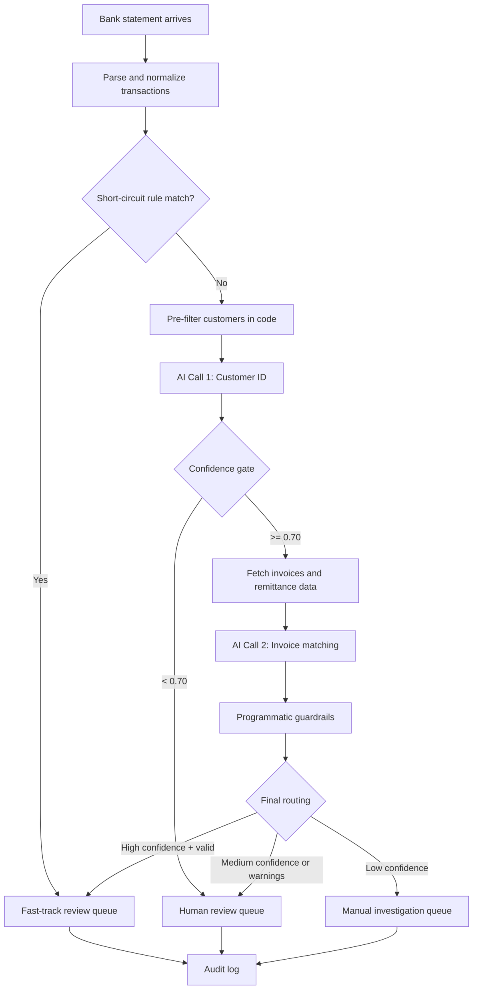

# Cash Application AI Pipeline - Solution Guide

**Audience:** Engineering, Treasury, Operations  
**Purpose:** Explain the production solution in a clear, practical way  
**Scope:** End-to-end matching flow (not vendor comparison or research history)

---

## 1) What This Solution Does

For each incoming bank credit, the system answers:

1. Which customer sent the payment?
2. Which invoice(s) does it settle?

The design is **hybrid**:

- **Code first** for deterministic steps (ingestion, filtering, checks, routing)
- **AI only where reasoning is needed** (customer identification + invoice allocation)
- **Human review for uncertain cases**

This keeps cost and latency low while maintaining auditability.

---

## 2) Core Design (Simple but Strong)

### A. Start with deterministic rules

If exact matches are found (account + amount, memo invoice reference, etc.), skip AI and send to fast-track human review.

### B. Use two small AI calls, not one large call

- **Call 1:** identify customer from 3-8 candidates
- **Call 2:** match payment to invoice lines with deductions/unmatched amount

This is cheaper, easier to monitor, and easier to debug than one giant prompt.

### C. Use confidence gates in code

The AI never directly posts to ERP. Code applies thresholds and guardrails before any final action.

### D. Force structured JSON output

Both calls return strict schema-based JSON for reliable downstream processing.

---

## 3) End-to-End Flow

## Diagram (High-Level)




## Step-by-Step

### Step 0 - Ingest bank statement

- Input formats: MT940 / BAI2 / CSV
- Parse each credit line into a normalized transaction object:
  - amount, date, payer text, reference, memo, bank account metadata

### Step 1 - Short-circuit checks (no AI)

- Exact payer account -> known customer + exact open amount match
- Invoice number found in memo/reference + amount checks out
- Single-customer/single-invoice obvious exact match

If any pass, send directly to fast-track review. This handles a large chunk at zero AI cost.

### Step 2 - Pre-filter customers (no AI)

Reduce search space from entire customer base to 3-8 candidates using:

- Fuzzy name similarity
- Invoice amount-combination search (with tolerance)
- [Can be removed] Alias/reference/account lookups

### Step 3 - AI Call 1 (customer identification)

Input:

- bank transaction
- shortlist of candidates with supporting metadata

Output JSON (schema-enforced):

- `customer_id`
- `customer_name`
- `confidence` (0-1)
- `reasoning`

### Step 4 - Confidence gate (code)

- `>= 0.90`: proceed with identified customer
- `0.70-0.89`: allow next stage with top candidate(s)
- `< 0.70`: route to human review immediately

### Step 5 - Gather payment evidence (no AI)

For selected customer:

- fetch open invoices
- fetch remittance email(s)/parsed attachments
- build a concise evidence package for invoice matching

### Step 6 - AI Call 2 (invoice matching)

Input:

- payment details
- candidate invoices
- remittance evidence

Output JSON (schema-enforced):

- `customer_id`, `confidence`
- `invoices[]` with `id`, `original_amount`, `applied`, `deduction`, `reason`
- `total_applied`, `unmatched_amount`, `reasoning`

### Step 7 - Guardrails (hard validation in code)

Before any posting:

- applied amounts sum correctly
- invoice IDs exist and are open
- deductions fit policy
- no duplicate application against already-settled invoices

If any guardrail fails, force manual investigation.

### Step 8 - Final routing

- **Fast-track review:** high confidence + guardrails pass + no unmatched amount
- **Human review:** medium confidence or policy warning
- **Manual investigation:** low confidence / unresolved mismatch

### Step 9 - Audit logging

Store full trace:

- raw transaction, AI outputs, confidence, guardrail results, final action
- human override decisions (if any)

This supports compliance, model QA, and continuous improvement.

---

## 4) Confidence and Routing Policy (Recommended Defaults)


| Stage        | Condition                                   | Route                      |
| ------------ | ------------------------------------------- | -------------------------- |
| After Call 1 | `< 0.70`                                    | Human review (skip Call 2) |
| After Call 2 | `>= 0.95` + guardrails pass + unmatched = 0 | Fast-track review          |
| After Call 2 | `0.70-0.94` or any warning                  | Human review               |
| Any stage    | severe inconsistency                        | Manual investigation       |


Tune these thresholds later based on observed precision/recall.

---

## 5) Data Contract (Minimal Required JSON)

### Call 1 result

```json
{
  "customer_id": "CUST-0091",
  "customer_name": "Acme Corp Ltd",
  "confidence": 0.93,
  "reasoning": "Name and amount pattern best match"
}
```

### Call 2 result

```json
{
  "customer_id": "CUST-0091",
  "confidence": 0.97,
  "invoices": [
    {
      "id": "INV-312",
      "original_amount": 25000.0,
      "applied": 25000.0,
      "deduction": 0.0,
      "reason": null
    }
  ],
  "total_applied": 25000.0,
  "unmatched_amount": 0.0,
  "reasoning": "Remittance confirms invoice allocation"
}
```

---

## 6) Why This Architecture Works

- High automation on clean payments through short-circuit rules
- Controlled AI usage only where human-style judgment adds value
- Deterministic guardrails prevent unsafe posting decisions
- Clear confidence-based routing keeps reviewers focused on true exceptions
- Full auditability for treasury and compliance

---

## 7) Implementation Checklist

- Build deterministic short-circuit module first
- Build pre-filter + candidate scoring
- Implement Call 1 and Call 2 with strict schemas
- Add confidence gates and guardrails in orchestrator
- Add human review queue with pre-filled AI suggestion
- Add full audit logs and daily quality metrics

This sequence gives usable value early and reduces delivery risk.